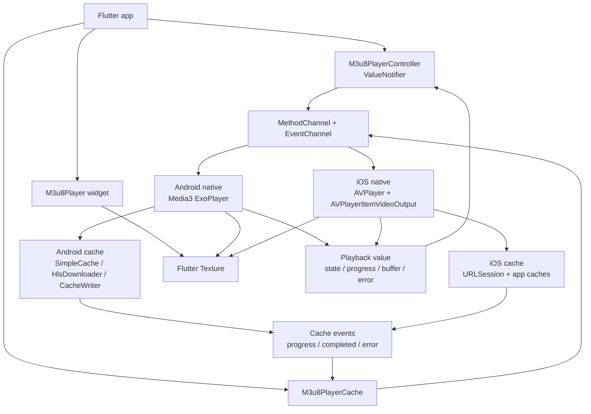

# player_m3u8 架构说明 / Architecture

[中文](#中文) | [English](#english)

## 中文

本文档面向维护者和需要理解平台差异的接入方。新手接入请先看 [README.md](README.md)。

### 总览

`player_m3u8` 是一个 Flutter plugin，Dart 层提供 `M3u8PlayerController`、`M3u8Player`、`M3u8PlayerCache` 等公开 API；原生层负责播放器实例、Texture 输出、播放事件、缓存任务和平台能力适配。

| 平台 | 播放内核 | 渲染 | 缓存实现 |
| --- | --- | --- | --- |
| Android | Media3 ExoPlayer + HLS/progressive | Flutter Texture / SurfaceProducer | Media3 `SimpleCache`、`HlsDownloader`、`CacheWriter` |
| iOS | AVFoundation `AVPlayer` + `AVPlayerItemVideoOutput` | FlutterTexture | app caches、URLSession 独立预缓存、progressive 本地文件复用 |

iOS HLS 主播放链路保持 direct `AVPlayer` 远程播放，不通过 cache-backed ResourceLoader 接管 HLS 播放路径。这样优先保留 AVFoundation 对 HLS 的兼容性；独立 HLS 预缓存仍可下载常见 VOD playlist，并通过缓存事件上报进度。

### 架构图



### Dart 层职责

- `M3u8PlayerController` 是播放控制中心，也是 `ValueNotifier<M3u8PlayerValue>`。
- `M3u8PlayerValue` 承载 UI 需要的播放状态：是否初始化、是否播放、是否缓冲、播放进度、总时长、播放器缓冲、磁盘缓存、清晰度、字幕、音轨、错误和诊断信息。
- `M3u8Player` 只负责将 native texture 展示到 Flutter UI。
- `M3u8PlayerCache` 负责独立缓存任务：配置容量、查询缓存信息、创建预缓存、暂停、恢复、取消和清理。
- `qoeSnapshots` 提供按窗口采样的播放质量指标，用于 UI 展示或埋点。

### 播放链路

初始化或切换 source 时，Dart 层把 `M3u8Source`、字幕、初始位置、清晰度、恢复策略、倍速和音量状态传给原生层。

原生层创建新的 native player，并把视频帧写入 Flutter Texture。播放事件通过 event channel 回到 Dart，`M3u8PlayerController` 将事件合并到 `M3u8PlayerValue`，Flutter UI 通过 `ValueListenableBuilder` 自动刷新。

切换 source 时必须释放旧 native player，并取消旧 source 的播放器内部主动预取。旧 source 已经落盘的数据可以保留复用，但旧 source 不应继续后台下载。

### 缓存模型

插件里有两类缓存概念：

| 类型 | 由谁创建 | 主要用途 | 是否进入下载列表 |
| --- | --- | --- | --- |
| 播放器内部缓存/预取 | 当前播放器 | 服务当前播放、seek 后优先预取、短期复用 | 否 |
| 独立预缓存任务 | 业务调用 `M3u8PlayerCache.precache` | 播放前下载、下载列表、离线式复用 | 是 |

播放器内存缓冲必须保持有界，不能通过扩大 native player forward buffer 来实现完整缓存。完整缓存和预取走磁盘缓存或下载任务。

默认缓存 key 包含 URL 和请求 headers，避免不同 Authorization、Cookie 或地区 header 的资源互相复用。如果业务确认短期签名 URL 指向同一个不可变视频，可以用 `M3u8Source.cacheKey` 传入稳定业务 key；不要把用户敏感信息写入 `cacheKey`。

### 平台差异

Android:

- HLS 播放和下载优先使用 Media3 原生能力。
- HLS 播放、HLS 独立下载和 progressive 独立下载共用 `SimpleCache`。
- HLS playlist 解析、下载和 progressive 写入使用 Media3 `HlsPlaylistParser`、`HlsDownloader`、`CacheWriter` 等能力。
- 手动清晰度通过 ExoPlayer track selector 约束最高视频尺寸和码率。

iOS:

- HLS 播放主链路使用 direct `AVPlayer`，不接管 ResourceLoader 播放路径。
- HLS 独立预缓存走 app caches，只承诺常见 VOD playlist。
- progressive MP4/MOV 独立下载完成后，新建播放器可优先复用本地缓存文件。
- 手动 HLS 清晰度属于 best-effort，最终播放选择仍由 AVPlayer ABR 决定。

### 事件和诊断

播放事件会更新 `M3u8PlayerValue`，包括：

- `isPlaying`、`isBuffering`、`isCompleted`
- `position`、`duration`、`bufferedPosition`
- `diskCacheStartPosition`、`diskCachePosition`、`diskCachePercent`
- `startupTime`、`rebufferCount`、`rebufferDuration`
- `droppedFrames`、`videoBitrate`、`observedBitrate`
- `availableQualities`、`selectedQuality`
- `availableSubtitles`、`selectedSubtitle`、`subtitleText`
- `availableAudioTracks`、`selectedAudioTrack`
- `recoveryCount`、`lastRecoveryReason`
- `error`、`diagnostics`

缓存事件通过 `M3u8PlayerCache.events()` 上报，包括任务 id、owner、状态、字节进度、segment 进度、速度、重试次数、错误和 metadata。

诊断信息用于线上错误聚合与 QoE 归因。不要把业务敏感数据放进 URL 查询参数、headers 日志或 `cacheKey` 后直接上报。

### 性能和生命周期原则

- 渲染方式保持 Flutter `Texture`，不要改成 PlatformView。
- native player forward buffer 保持有界，避免 OOM。
- 完整缓存和预取走磁盘，不走无界内存。
- 当前 source 暂停播放时可以继续磁盘预取，直到完成或 dispose/source 切换。
- 当前 source seek 后应取消当前主动预取，并从 seek 目标时间对应的分片开始优先预取。
- `dispose()` 必须释放 native player、取消播放器内部任务、关闭事件订阅。
- 独立下载任务属于业务生命周期；业务需要在合适时机暂停、恢复或取消。

### 当前限制

- 支持网络 HLS/m3u8 VOD 和 progressive MP4/MOV；不支持 DASH、SmoothStreaming、RTSP、FLV 或本地文件。
- MP4/MOV 支持独立完整下载和完成后缓存复用，但不支持清晰度选择。
- iOS progressive 暂不暴露外部字幕。
- iOS HLS 磁盘预取只承诺常见 VOD playlist。live/event playlist、`#EXT-X-BYTERANGE`、I-frame-only playlist、复杂加密或 DRM playlist 会返回 `unsupported_hls_playlist` 缓存错误，播放链路不因此失败。
- 原生层不承诺 app 重启后恢复未完成下载队列；如果业务需要下载列表持久化，应在业务层保存任务和 source 信息，并在启动后查询 `sourceInfo` 恢复展示。

### 验证

常规 Dart 修改：

```sh
flutter analyze
flutter test
cd example && flutter test
```

涉及原生代码时额外运行：

```sh
cd example/android && ./gradlew testDebugUnitTest
cd ../.. && cd example && flutter build apk --debug
cd example && flutter build ios --simulator --debug
```

## English

This document is for maintainers and integrators who need to understand platform differences. For first-time integration, start with [README.md](README.md).

### Overview

`player_m3u8` is a Flutter plugin. The Dart layer exposes public APIs such as `M3u8PlayerController`, `M3u8Player`, and `M3u8PlayerCache`; the native layer owns player instances, Texture output, playback events, cache tasks, and platform adaptation.

| Platform | Playback engine | Rendering | Cache implementation |
| --- | --- | --- | --- |
| Android | Media3 ExoPlayer + HLS/progressive | Flutter Texture / SurfaceProducer | Media3 `SimpleCache`, `HlsDownloader`, `CacheWriter` |
| iOS | AVFoundation `AVPlayer` + `AVPlayerItemVideoOutput` | FlutterTexture | app caches, URLSession standalone precache, progressive local-file reuse |

iOS HLS playback stays on direct remote `AVPlayer` and does not take over the HLS playback path with a cache-backed ResourceLoader. This preserves AVFoundation compatibility. Standalone HLS precache can still download common VOD playlists and report progress through cache events.

### Architecture Diagram


### Dart Layer Responsibilities

- `M3u8PlayerController` is the playback control center and a `ValueNotifier<M3u8PlayerValue>`.
- `M3u8PlayerValue` carries UI-facing playback state: initialization, playing, buffering, position, duration, player buffer, disk cache, quality, subtitles, audio tracks, errors, and diagnostics.
- `M3u8Player` only displays the native texture in Flutter UI.
- `M3u8PlayerCache` owns standalone cache tasks: capacity configuration, cache info, precache creation, pause, resume, cancel, and clearing.
- `qoeSnapshots` exposes windowed playback quality samples for UI or analytics.

### Playback Flow

On initialization or source switching, the Dart layer sends `M3u8Source`, subtitles, initial position, quality, recovery policy, playback speed, and audio state to the native layer.

The native layer creates a new player and writes video frames into a Flutter Texture. Playback events return through the event channel. `M3u8PlayerController` merges those events into `M3u8PlayerValue`, and Flutter UI refreshes through `ValueListenableBuilder`.

When switching source, the old native player must be released and the old source's player-owned active prefetch must be cancelled. Data already written to disk can be reused, but the old source must not continue downloading in the background.

### Cache Model

The plugin has two cache concepts:

| Type | Created by | Purpose | Appears in download list |
| --- | --- | --- | --- |
| Player-owned cache/prefetch | Current player | Current playback, seek-aware prefetch, short-term reuse | No |
| Standalone precache task | App calls `M3u8PlayerCache.precache` | Pre-download, download list, offline-style reuse | Yes |

Player memory buffers must remain bounded. Complete caching and prefetching must use disk cache or download tasks, not unbounded native forward buffers.

Default cache keys include URL and request headers to avoid unsafe reuse across Authorization, Cookie, or region headers. If short-lived signed URLs identify the same immutable video, use `M3u8Source.cacheKey` for a stable business key. Do not put sensitive user data into `cacheKey`.

### Platform Differences

Android:

- HLS playback and downloads prefer Media3-native capabilities.
- HLS playback, HLS standalone downloads, and progressive standalone downloads share `SimpleCache`.
- HLS playlist parsing, HLS downloading, and progressive writes use Media3 APIs such as `HlsPlaylistParser`, `HlsDownloader`, and `CacheWriter`.
- Manual quality constrains maximum video size and bitrate through ExoPlayer track selection.

iOS:

- HLS playback uses direct `AVPlayer` and does not take over the playback path with ResourceLoader.
- Standalone HLS precache uses app caches and only commits to common VOD playlists.
- After a progressive MP4/MOV standalone download completes, a new player can reuse the local cache file.
- Manual HLS quality is best-effort; the final rendition is still chosen by AVPlayer ABR.

### Events And Diagnostics

Playback events update `M3u8PlayerValue`, including:

- `isPlaying`, `isBuffering`, `isCompleted`
- `position`, `duration`, `bufferedPosition`
- `diskCacheStartPosition`, `diskCachePosition`, `diskCachePercent`
- `startupTime`, `rebufferCount`, `rebufferDuration`
- `droppedFrames`, `videoBitrate`, `observedBitrate`
- `availableQualities`, `selectedQuality`
- `availableSubtitles`, `selectedSubtitle`, `subtitleText`
- `availableAudioTracks`, `selectedAudioTrack`
- `recoveryCount`, `lastRecoveryReason`
- `error`, `diagnostics`

Cache events are reported through `M3u8PlayerCache.events()` and include task id, owner, status, byte progress, segment progress, speed, retry count, error, and metadata.

Diagnostics are intended for production error aggregation and QoE attribution. Do not forward sensitive business data from URL query parameters, header logs, or `cacheKey` into analytics.

### Performance And Lifecycle Principles

- Keep rendering on Flutter `Texture`; do not switch to PlatformView.
- Keep native player forward buffers bounded to avoid OOM.
- Complete caching and prefetching go through disk, not unbounded memory.
- The current source may continue disk prefetch while playback is paused, until completion, dispose, or source switching.
- After seek, cancel current active prefetch and restart near the segment matching the seek target.
- `dispose()` must release the native player, cancel player-owned tasks, and close event subscriptions.
- Standalone download tasks belong to the app lifecycle; the app should pause, resume, or cancel them at the right time.

### Current Limitations

- Network HLS/m3u8 VOD and progressive MP4/MOV are supported. DASH, SmoothStreaming, RTSP, FLV, and local files are not supported.
- MP4/MOV supports standalone full-file download and cache reuse after completion, but not quality selection.
- iOS progressive does not expose external subtitles yet.
- iOS HLS disk prefetch only commits to common VOD playlists. Live/event playlists, `#EXT-X-BYTERANGE`, I-frame-only playlists, complex encryption, and DRM playlists report an `unsupported_hls_playlist` cache error without failing playback.
- Native task queues are not restored after app restart. If the app needs a persistent download list, save task and source information in the app layer and query `sourceInfo` on startup to restore display state.

### Verification

For regular Dart changes:

```sh
flutter analyze
flutter test
cd example && flutter test
```

For native changes, also run:

```sh
cd example/android && ./gradlew testDebugUnitTest
cd ../.. && cd example && flutter build apk --debug
cd example && flutter build ios --simulator --debug
```
