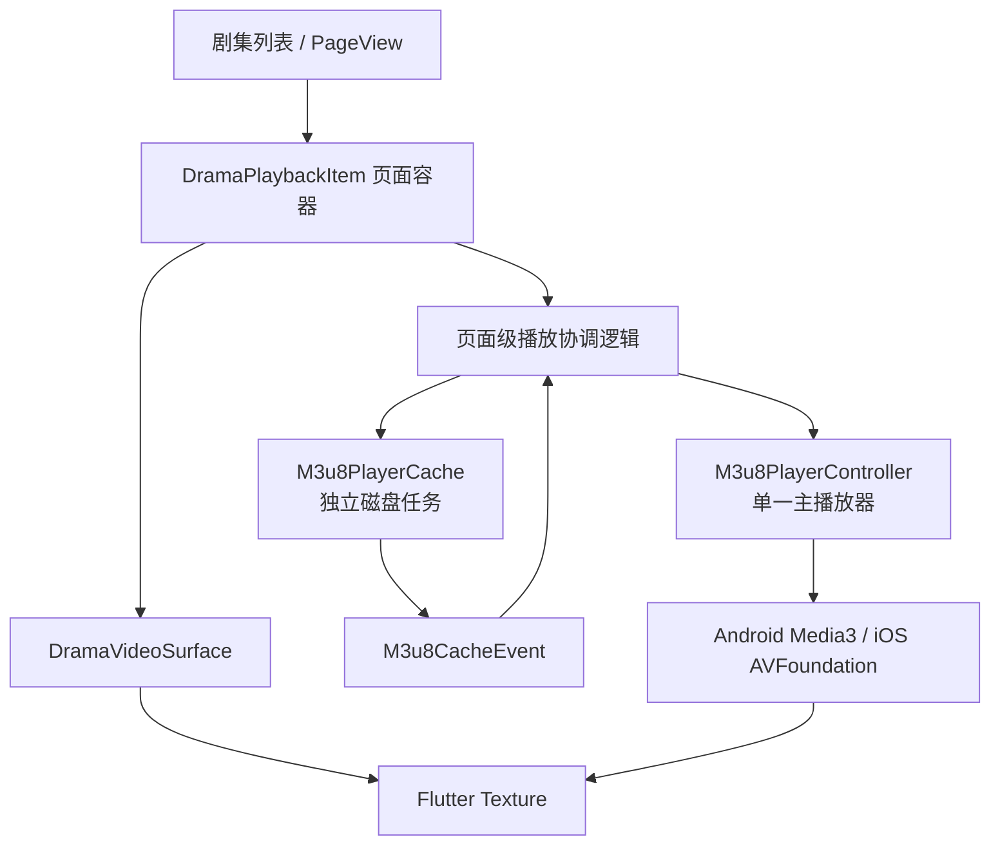
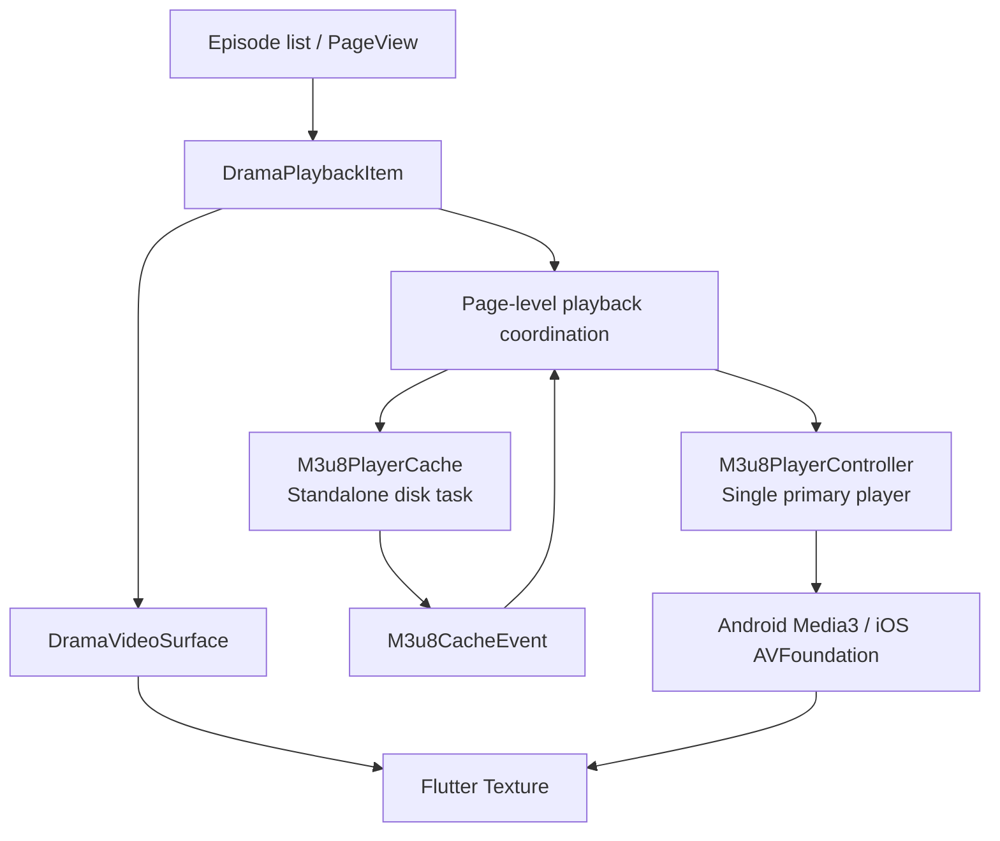

# Reels / Shorts 播放架构与实现规范

[中文](#中文) | [English](#english)

## 中文

本文档说明 `player_m3u8` 在短视频、短剧和 Reels 类场景中的推荐播放架构，以及当前示例播放页的实现细节。目标是：快速切换、低内存占用、可控缓存、稳定的生命周期和可观测的失败行为。

## 1. 设计目标

- 页面滚动与播放器生命周期解耦。
- 同一时刻只保留一个主播放播放器，避免每个页面创建 native player 和解码器。
- 当前视频播放使用有界的原生内存缓冲；完整缓存和预加载使用磁盘任务。
- 点击选集直接定位，手势滑动才使用 `PageView` 的自然滚动动画。
- 播放暂停不影响独立磁盘预加载。
- source 切换释放旧 native player，取消旧预加载，并防止过期异步结果污染当前页面。
- Android 与 iOS 保持各自原生最佳实践，Flutter 侧只依赖统一 API 和状态模型。

## 2. 总体架构



核心原则是：`PageView` 页面可以很多，但 `M3u8PlayerController` 只有一个。非当前页面只渲染封面，不绑定正在播放的 Texture。

## 3. 组件职责

### 3.1 `DramaPlaybackPage`

页面级协调器，负责：

- 保存当前剧集索引。
- 创建并销毁唯一的 `M3u8PlayerController`。
- 初始化首集和通过 `setSource` 切换后续剧集。
- 串行化 source 切换，跳过已经过期的请求。
- 保存当前剧集播放进度。
- 管理下一集及后续剧集的独立预加载任务。

### 3.2 `DramaPlaybackItem`

纯 UI 页面容器，负责：

- 当前页面的封面、Texture 和渐变层。
- 全屏点击手势。
- 中心播放按钮和控制层。
- 仅当前页面显示播放器画面；非当前页显示封面。

它不创建播放器，也不决定 source 生命周期。

### 3.3 `M3u8PlayerController`

插件提供的播放控制中心，封装：

- native player 创建和销毁。
- `play`、`pause`、`seekTo`、倍速、音量和字幕控制。
- `M3u8PlayerValue` 状态更新。
- 播放事件、缓冲、错误和 QoE 指标。

### 3.4 `M3u8PlayerCache`

独立磁盘缓存 API，负责：

- 创建预加载任务。
- 监听进度和完成事件。
- 暂停、恢复和取消任务。
- 配置缓存容量和最大并发任务数。

播放暂停与该任务没有隐式耦合。业务层可以决定暂停播放时是否继续下载。

## 4. 播放生命周期

### 4.1 首次进入

```text
创建唯一 M3u8PlayerController
        |
initialize(firstSource, autoPlay: true)
        |
native player 创建
        |
Texture 输出视频帧
        |
启动 next episode 独立预加载
```

初始化异常必须被业务层捕获，不能通过未处理的 `unawaited` Future 让页面崩溃。播放器状态仍通过 `M3u8PlayerValue.error` 或 UI fallback 展示。

### 4.2 页面切换

```text
PageView.onPageChanged(index)
        |
更新当前 index
        |
使旧预加载任务失效并取消
        |
等待切换队列轮到当前请求
        |
controller.setSource(newSource, autoPlay: true)
        |
释放旧 native player
        |
新 source 初始化并播放
        |
预加载 newIndex + 1
```

`setSource` 内部会释放旧 native player。业务层使用递增 request token 或串行 Future 队列，保证快速连续切换时旧请求不会覆盖新页面。

### 4.3 销毁

销毁顺序：

1. 停止进度保存定时器。
2. 取消缓存事件订阅。
3. 取消当前独立预加载任务。
4. 释放 `M3u8PlayerController` 和 native player。
5. 释放页面和 UI notifier。

## 5. 手势和控制层

全屏 `GestureDetector` 位于中心播放按钮和其他控制层下方：

```dart
Positioned.fill(
  child: GestureDetector(
    behavior: HitTestBehavior.opaque,
    onTap: onPlayPause,
    child: const _DramaGradientOverlay(),
  ),
),
```

事件规则：

- 点击画面空白区域：切换播放/暂停。
- 点击中心播放按钮：只触发按钮，不重复触发底层手势。
- 速度菜单展开时点击画面：先关闭速度菜单，不切换播放状态。
- 点击进度条：由 `BufferedSeekBar` 处理，不触发播放切换。
- 上下滑动翻页：由外层 `PageView` 处理；`GestureDetector` 只在 tap 成功时执行回调。

手势层不再使用 `M3u8PlayerGestureControls`，因为该页面没有亮度、音量和拖动 seek 手势需求。

## 6. Loading、暂停和错误状态

中心 loading 显示条件：

```text
!value.isInitialized
或
value.isBuffering
```

错误状态优先级更高：

```text
value.hasError => 不显示无限 loading，显示错误或重试 UI
```

播放器暂停不会自动暂停独立预加载任务。预加载任务只有在以下情况才取消：

- source 切换。
- 页面销毁。
- 预加载目标已经过期。
- 用户明确取消下载。

## 7. 下一集预加载策略

业务层通过 `M3u8PlayerCache.precache` 创建独立任务，并使用 metadata 标识目标剧集：

```dart
final taskId = await M3u8PlayerCache.precache(
  nextSource,
  priority: 10,
  metadata: {'episodeIndex': nextIndex},
);
```

缓存事件通过 `M3u8Cache.events()` 监听：

```text
当前集开始播放
        |
预加载下一集
        |
收到 completed
        |
启动下下一集预加载
```

推荐并发策略：

| 任务 | 优先级 | 说明 |
| --- | ---: | --- |
| 当前播放 | 最高 | 由播放器内部有界缓冲负责 |
| 下一集 | 10 | 首选独立磁盘预加载目标 |
| 下下一集 | 低 | 仅在缓存空间和网络允许时启动 |
| 更远剧集 | 不启动 | 只保留封面和元数据 |

预加载是 best-effort 能力：不支持的平台、直播流、复杂 DRM 或不兼容 playlist 不应阻断播放。

## 8. Android 与 iOS 平台差异

### Android

- 播放内核为 Media3 ExoPlayer。
- HLS 使用 `HlsMediaSource`，独立预加载使用 Media3 下载和缓存能力。
- 播放和独立预加载可以复用 `SimpleCache`。
- native player 和下载任务生命周期必须分别管理。

### iOS

- 播放内核为 AVFoundation `AVPlayer`。
- 使用 Flutter Texture 输出视频帧。
- HLS 主播放链路保持 direct `AVPlayer`，独立预加载走 URLSession/app cache。
- HLS 预加载能力受 playlist 类型、加密和系统后台策略限制。

Flutter 层不应根据平台写两套播放切换逻辑，只处理统一的 Controller、Cache API 和事件模型。

## 9. 并发、异常和资源安全

- 不在未初始化状态调用 `play`、`pause`、`seekTo` 或其他需要 player id 的方法。
- source 切换必须串行，避免 `setSource` 重入。
- 每个预加载任务必须保存 task id，并在 source 切换时取消。
- 缓存事件必须校验 task id，忽略旧任务和其他页面的事件。
- `unawaited` 只用于明确可安全忽略结果的操作；初始化、切源和缓存创建必须捕获异常。
- 不把 token、Cookie 或 Authorization 写入日志、metadata 或稳定 cache key。
- 内存缓冲必须有界，完整视频不能通过扩大 forward buffer 实现。

## 10. 复杂度和性能

| 操作 | 时间复杂度 | 额外空间 | 说明 |
| --- | --- | --- | --- |
| 播放/暂停 | O(1) | O(1) | 一次 native 命令 |
| source 切换调度 | O(1) | O(1) | request token + 串行队列 |
| 取消预加载 | O(1) | O(1) | 按 task id 定位 |
| 缓存事件处理 | O(1) | O(1) | 只校验当前 task id |
| 页面渲染 | O(1) | O(1) | 当前页共享单一 Texture |

单播放器方案的主要收益是降低 native player、解码器、Texture 和内存峰值数量；代价是切换 source 时需要等待新 source 初始化，因而应配合封面、loading 和下一集磁盘预取。

## 11. 测试要求

至少覆盖：

- 首次初始化显示 loading，初始化完成后 loading 消失。
- 播放中点击画面调用 `pause`。
- 暂停时点击中心按钮调用 `play`，且不重复调用。
- 速度菜单展开时点击画面只关闭菜单。
- 快速切换 source 时不会对未初始化 Controller 调用 `play/pause`。
- 选集从远距离索引跳转不会产生跨页动画。
- 下一集预加载完成后会顺延启动下一任务。
- source 切换和页面销毁会取消旧预加载任务。
- 空剧集列表销毁不会访问无效索引。

常规验证命令：

```sh
flutter analyze
flutter test
cd example && flutter analyze
cd example && flutter test
```

涉及 Android/iOS 原生改动时，再执行 Gradle 单测和 Android/iOS debug 构建。

## 12. 当前实现边界

当前示例播放页已经采用单一主播放器、`setSource` 切换、过期请求保护、中心 loading、全屏点击控制和独立下一集预加载。预加载受平台能力、网络状态、缓存容量和 playlist 类型影响，不能替代播放失败重试机制。

生产环境还应补充：

- 预加载任务持久化和应用重启恢复。
- 网络类型和流量策略，例如蜂窝网络下限制下下一集预加载。
- 缓存命中率、首帧耗时、切换耗时和预加载成功率埋点。
- 错误 UI 和重试入口。
- 对快速连续选集、后台/前台切换和内存压力的集成测试。

## English

This document describes the recommended architecture for Reels, Shorts, and short-drama playback built with `player_m3u8`. It also documents the implementation currently used by the example playback page. The goals are fast source switching, bounded memory usage, predictable caching, correct lifecycle handling, and observable failures.

### 1. Design Goals

- Decouple page scrolling from player lifecycle.
- Keep one primary native player instead of creating one player and decoder per page.
- Keep playback buffering bounded; use disk tasks for complete caching and preloading.
- Jump directly when the user selects an episode; reserve animated scrolling for touch swipes.
- Keep standalone disk preloading running while playback is paused.
- Release the old native player and cancel obsolete preload work during source changes.
- Preserve platform-native playback behavior on Android and iOS behind one Flutter API.

### 2. Overall Architecture



There may be many `PageView` children, but there is only one `M3u8PlayerController`. Inactive pages render their cover image and do not bind the active video Texture.

### 3. Component Responsibilities

`DramaPlaybackPage` is the page-level coordinator. It owns the current index, creates and disposes the single controller, initializes and switches sources, serializes source changes, saves progress, and manages next-episode preload tasks.

`DramaPlaybackItem` is a UI container. It renders the cover, Texture, gradient, full-screen tap layer, play button, and controls. It never creates a native player and never owns source lifetime.

`M3u8PlayerController` owns native player commands and exposes `M3u8PlayerValue` for initialization, playing, buffering, progress, errors, and QoE state.

`M3u8PlayerCache` owns standalone disk tasks: cache configuration, precache creation, progress events, pause/resume, cancellation, and cache cleanup.

### 4. Playback Lifecycle

#### Initial entry

```text
Create one M3u8PlayerController
        |
initialize(firstSource, autoPlay: true)
        |
Create native player
        |
Render frames into Flutter Texture
        |
Start standalone preload for the next episode
```

Initialization failures must be caught by the app layer. An unhandled `unawaited` Future must never crash the page. The player value or UI fallback should expose the failure.

#### Page change

```text
PageView.onPageChanged(index)
        |
Update current index
        |
Invalidate and cancel obsolete preload
        |
Wait for the source-switch queue
        |
controller.setSource(newSource, autoPlay: true)
        |
Dispose old native player
        |
Initialize and play the new source
        |
Preload newIndex + 1
```

`setSource` releases the old native player. A monotonically increasing request token and a serialized Future queue prevent stale rapid-switch requests from overwriting the current page.

#### Disposal

Stop the progress timer, cancel the cache event subscription, cancel the standalone preload task, dispose the controller/native player, and dispose page/UI notifiers.

### 5. Gestures and Controls

The full-screen `GestureDetector` is below the center play button and other controls:

```dart
Positioned.fill(
  child: GestureDetector(
    behavior: HitTestBehavior.opaque,
    onTap: onPlayPause,
    child: const _DramaGradientOverlay(),
  ),
),
```

The rules are:

- Tap an empty video area to toggle play/pause.
- Tap the center play button to trigger only the button, without duplicate bubbling.
- When the speed menu is open, a video-area tap closes the menu instead of changing playback.
- The progress bar owns its own drag interaction.
- Vertical swipes remain owned by the outer `PageView`; the tap recognizer fires only when the pointer sequence resolves as a tap.

`M3u8PlayerGestureControls` is intentionally not used on this page because brightness, volume, and gesture-based seek are not required there.

### 6. Loading, Pause, and Error State

Show the centered loading indicator when `!value.isInitialized` or `value.isBuffering`. Error state has higher priority: when `value.hasError` is true, do not show an endless spinner; show an error or retry UI instead.

Pausing playback does not pause the standalone preload task. Preload work is cancelled only on source changes, page disposal, obsolete targets, or explicit user cancellation.

### 7. Next-Episode Preloading

The app creates a standalone task through `M3u8PlayerCache.precache` and stores the target episode in metadata:

```dart
final taskId = await M3u8PlayerCache.precache(
  nextSource,
  priority: 10,
  metadata: {'episodeIndex': nextIndex},
);
```

`M3u8Cache.events()` is used to chain the queue:

```text
Start current playback
        |
Preload next episode
        |
Receive completed
        |
Start preload for the following episode
```

Recommended priorities are current playback first, next episode at high priority, following episode only when capacity allows, and no preload for distant episodes. Preloading is best effort and must not block playback on unsupported platforms or playlists.

### 8. Android and iOS Differences

Android uses Media3 ExoPlayer, `HlsMediaSource`, and Media3 download/cache components. Playback and standalone HLS/progressive downloads can share `SimpleCache`, but player and task lifetimes remain separate.

iOS uses AVFoundation `AVPlayer` and Flutter Texture. Direct remote `AVPlayer` remains the primary HLS playback path; standalone HLS preload uses URLSession/app caches and is subject to playlist, encryption, and background execution limits.

Flutter code should keep one source-switch and task-management path rather than duplicating platform-specific playback logic.

### 9. Concurrency, Errors, and Resource Safety

- Never call player-id methods before initialization.
- Serialize source changes and invalidate stale requests.
- Store every preload task id and cancel it on source change or disposal.
- Match cache events by task id and ignore events from obsolete tasks.
- Catch initialization, source-switch, and cache-creation failures.
- Do not put tokens, cookies, or authorization data into logs, metadata, or stable cache keys.
- Keep native forward buffers bounded; complete media belongs in disk cache/tasks.

### 10. Complexity and Performance

| Operation | Time | Extra space | Notes |
| --- | --- | --- | --- |
| Play/pause | O(1) | O(1) | One native command |
| Source-switch scheduling | O(1) | O(1) | Request token and serialized queue |
| Cancel preload | O(1) | O(1) | Lookup by task id |
| Cache event handling | O(1) | O(1) | Validate the active task id |
| Page rendering | O(1) | O(1) | One shared active Texture |

The single-player design reduces native players, decoders, Textures, and peak memory. Its tradeoff is that a source switch must initialize the new source, so cover art, loading feedback, and next-episode disk preload are important for perceived responsiveness.

### 11. Test Requirements

Tests should cover initial loading, loading completion, play/pause taps, speed-menu dismissal, rapid source changes, direct long-distance episode jumps, chained next-episode preloads, cancellation on source change/disposal, and empty episode lists.

Run the standard checks with:

```sh
flutter analyze
flutter test
cd example && flutter analyze
cd example && flutter test
```

When native code changes, also run Android unit tests and Android/iOS debug builds.

### 12. Current Boundaries

The example playback page uses one primary player, `setSource` switching, stale-request protection, centered loading, full-screen tap control, and chained standalone preload. Preload behavior still depends on platform support, network conditions, cache capacity, and playlist type.

Production integrations should additionally consider persistent preload-task recovery, cellular-data policy, cache-hit and startup telemetry, retry UI, and integration tests for rapid selection, background/foreground transitions, and memory pressure.
